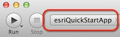

# DEPRECATiON NOTICE
This repo references the now-retired 10.2.x version of the Runtime SDK. Please see the [current SDK documentation](https://developers.arcgis.com/ios/latest/) where you will find tutorials, sample code, forums, conceptual guide doc, API reference, and more. To watch a simple Runtime app being built in under an hour, see [this Technical Session](https://youtu.be/9XWvvfRqPOU) from the 2020 Esri Developer Summit.

quickstart-map-ios
==================

A library and sample app to get started with Esri's iOS Runtime SDK.

Be sure to check out the:
* [Wiki](https://github.com/Esri/quickstart-map-ios/wiki)
* [Library Reference](https://github.com/Esri/quickstart-map-ios/wiki/Reference)

## Features
* Simplifies common functions down to one or two lines of code
* Demonstrate samples of using ArcGIS services and ArcGIS Runtime coding patterns for Geolocation, Directions, Geocoding and Searching
* Demonstrate client-side graphics editing

## Getting Started

### Configure your Dev environment
1. Follow the [steps on the ArcGIS Runtime SDK for iOS Resource Center](http://resources.arcgis.com/en/help/runtime-ios-sdk/concepts/#/Installation/00pw0000000w000000/) to install the SDK.
   
   Note: You will need to create an ESRI account to do so. Learn more [here](https://webaccounts.esri.com/cas/index.cfm).
2. Either clone or [download and unzip](https://github.com/Esri/quickstart-map-ios/archive/master.zip) this repository.

### Build & Run the Quick Start Sample Application
1. Open the EsriQuickStartApp Xcode project and run the `esriQuickStartApp` scheme on your device or simulator.

[New to Github? Get started here.](http://htmlpreview.github.com/?https://github.com/Esri/esri.github.com/blob/master/help/esri-getting-to-know-github.html)

## Requirements

* Xcode and the iOS SDK (download [here](https://developer.apple.com/xcode/))
* ArcGIS Runtime SDK for iOS 10.1.1 or later (download [here](http://www.esri.com/apps/products/download/index.cfm?fuseaction=download.all#ArcGIS_Runtime_SDK_for_iOS))
* Some experience with iOS development

For a version of this repo that's compatible with Runtime SDK for iOS v2.3.2, check [here](https://github.com/Esri/quickstart-map-ios/tree/runtime-sdk-2.3.2)

## Resources

* [ArcGIS Runtime SDK for iOS Resource Center](http://resources.arcgis.com/en/help/runtime-ios-sdk/concepts/#//00pw00000003000000)
* [ArcGIS Runtime SDK Forums](http://forums.arcgis.com/forums/78-ArcGIS-Runtime-SDK-for-iOS)
* [ArcGIS Blog](http://blogs.esri.com/esri/arcgis/)
* Twitter [@esri](http://twitter.com/esri)
* [Apple iOS Dev Center](https://developer.apple.com/devcenter/ios/index.action)

## Issues

Find a bug or want to request a new feature?  Please let us know by submitting an Issue.

## Contributing

Anyone and everyone is welcome to contribute. 

## Licensing
Copyright 2012 Esri

Licensed under the Apache License, Version 2.0 (the "License");
you may not use this file except in compliance with the License.
You may obtain a copy of the License at

   http://www.apache.org/licenses/LICENSE-2.0

Unless required by applicable law or agreed to in writing, software
distributed under the License is distributed on an "AS IS" BASIS,
WITHOUT WARRANTIES OR CONDITIONS OF ANY KIND, either express or implied.
See the License for the specific language governing permissions and
limitations under the License.

A copy of the license is available in the repository's [license.txt](https://raw.github.com/Esri/quickstart-map-ios/master/license.txt) file.

